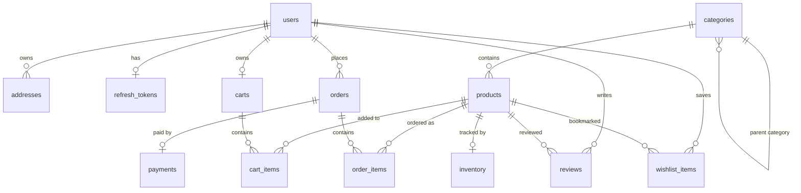
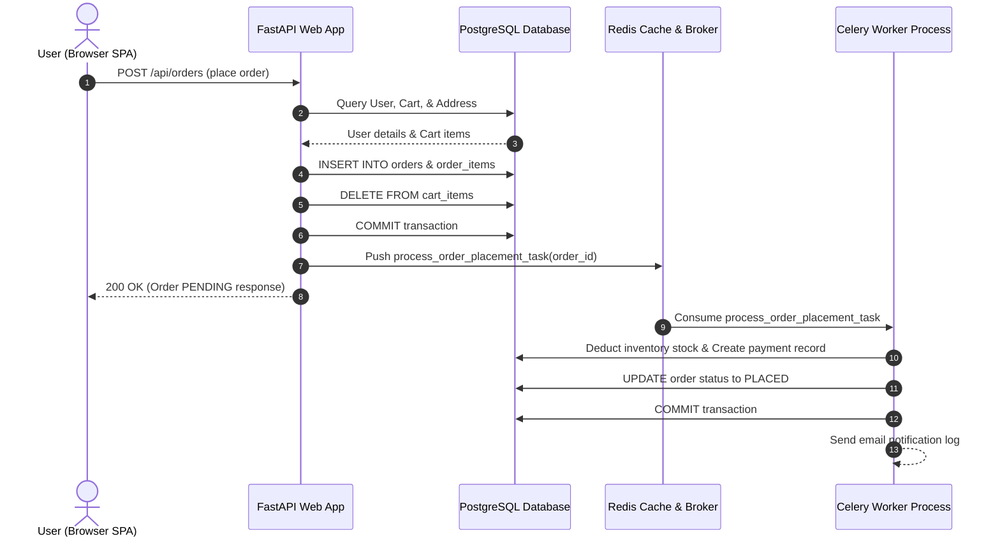

# CommerceFlow Architecture & System Design Documentation

## 1. Overview & System Philosophy

CommerceFlow is an e-commerce platform built as an asynchronous modular monolith using Python, FastAPI, SQLAlchemy 2.0, PostgreSQL, Redis, and Celery.

### Why a Modular Monolith?
When designing web systems, developers often jump directly to microservices. However, microservices introduce distributed system challenges such as network latency, distributed transaction complexity, deployment overhead, and complex logging across boundaries.

A modular monolith organizes the codebase into distinct feature packages (`auth`, `products`, `orders`, `cart`, `inventory`, etc.) that enforce clear domain separation while remaining inside a single deployable unit. This gives us:
- High performance without internal network latency between services.
- Simple single-command deployments (via Docker Compose or single process).
- Strong domain boundary isolation, making it straightforward to split a module into a microservice later if needed.

---

## 2. Tech Stack & Architectural Decisions

### Backend Technologies
- **Python 3.12 / 3.13**: Modern Python with strong typing support, async/await syntax, and high performance.
- **FastAPI**: An ASGI framework offering high speed, automatic request validation using Pydantic, automatic OpenAPI documentation, and native async support.
- **Uvicorn**: High-performance ASGI web server implementing the ASGI standard to handle concurrent connection requests non-blockingly.
- **SQLAlchemy 2.0 (Async)**: Modern ORM configured in fully asynchronous mode with `asyncpg`. Provides type-safe queries and explicit relationship loading controls.
- **asyncpg**: High-performance PostgreSQL database driver written specifically for Python async/await applications.
- **PostgreSQL**: Production-grade relational database for transactional consistency (ACID compliance), foreign keys, and indexes.
- **Redis**: In-memory data store used for two roles:
  1. High-speed caching for product details and search queries.
  2. Message broker and result backend for Celery background tasks.
- **Celery**: Distributed task queue used to offload long-running operations (such as order stock deduction, email sending, and payment processing) out of the HTTP request-response loop.
- **PyJWT & Passlib (Bcrypt)**: Password hashing and JWT generation for statelessly authenticating API calls.

### Frontend Technologies
- **Vanilla HTML5, CSS3, and JavaScript (ES6)**: Single-page application (SPA) built without heavy frontend framework overhead.
- **Hash-based Client Routing**: Lightweight client-side router (`#/products`, `#/cart`, `#/orders`, `#/admin`) handling dynamic page views without full browser refreshes.

---

## 3. Package & Module Structure

The project follows a package-per-feature directory layout inside `app/`:

```
app/
├── admin/          # Admin dashboard analytics and aggregate queries
├── auth/           # Registration, login, JWT issuance, and refresh token rotation
├── cart/           # Shopping cart operations and line item price snapshots
├── common/         # Global exception handlers, Redis connection, and data seeder
├── config.py       # Pydantic environment configuration settings
├── database.py     # SQLAlchemy async engine, sessionmaker, and Base model
├── inventory/      # Stock tracking, refill management, and low-stock alerts
├── main.py         # FastAPI application entry point, middleware, and router binding
├── orders/         # Order creation, order item snapshotting, and Celery background tasks
├── payments/       # Mock payment gateway verification and transaction records
├── products/       # Category hierarchy, product search, filtering, and Redis caching
├── reviews/        # Product ratings, user comments, and AI summary parsing
├── security/       # JWT token verification, IP rate limiting, and password helpers
├── users/          # User profile management and delivery address CRUD
└── wishlist/       # User saved item bookmarks
```

Each domain module generally contains:
- `models.py`: SQLAlchemy database tables and relationships.
- `schemas.py`: Pydantic request and response DTO definitions.
- `service.py`: Business logic, database interactions, and transactional logic.
- `router.py`: FastAPI endpoint definitions and route wiring.

---

## 4. Asynchronous Database Model & Relationship Handling

In SQLAlchemy 2.0 Async mode, accessing relationship properties (like `order.items` or `product.category`) requires explicit asynchronous loading. Attempting to access an un-loaded relationship synchronously causes a `MissingGreenlet` error because implicit lazy-loading IO is disabled in async engines.

To guarantee zero runtime greenlet crashes, CommerceFlow uses a strict loading strategy:

1. **Forward Required Relationships (`lazy="selectin"`)**:
   Relationships that are almost always needed when fetching a parent object (such as `Product.category`, `Product.images`, `Cart.items`, `Order.items`, `WishlistItem.product`) are configured with `lazy="selectin"`. When the parent is queried, SQLAlchemy automatically executes a secondary `SELECT ... WHERE id IN (...)` batch query in the same async turn.

2. **Back-References & Secondary Relationships (`lazy="noload"`)**:
   Parent-pointing back-references (such as `OrderItem.order`, `Payment.order`, `ProductImage.product`, `Inventory.product`, `Category.products`) are configured with `lazy="noload"`. This prevents circular eager loading loops (e.g. `Order` loading `Payment` loading `Order` loading `OrderItem` loading `Order`).

3. **Explicit Query Options (`selectinload`)**:
   In complex queries (like `search_all_products` or `get_or_create_cart`), query statements explicitly specify `.options(selectinload(...))` to ensure all required nested relationships are fetched cleanly in batch operations.

---

## 5. Background Task Architecture (Celery + Redis)

When a customer places an order, the system must perform several tasks:
1. Verify stock availability.
2. Create the order record and snapshot order line items.
3. Clear the user's shopping cart.
4. Deduct inventory stock levels.
5. Initialize a payment transaction record.
6. Send confirmation email notifications.

If all six steps were executed synchronously inside the HTTP handler, the web request would take seconds to complete, making the application slow and vulnerable to timeouts during traffic spikes.

### Asynchronous Checkout Flow:
1. **HTTP Handler (`POST /api/orders`)**:
   - Performs validation (user email verified, cart not empty, stock available).
   - Writes `Order` and `OrderItem` records to PostgreSQL in `PENDING` status.
   - Clears the shopping cart items.
   - Commits the transaction and dispatches a task to Celery: `process_order_placement_task.delay(order_id)`.
   - Immediately returns a `200 OK` response with the created order summary to the user.

2. **Celery Background Worker**:
   - Receives the message from the Redis message queue.
   - Fetches the order from PostgreSQL.
   - Deducts stock quantities from the `inventory` table.
   - Creates a `Payment` record in `PENDING` status attached to the order.
   - Updates order status from `PENDING` to `PLACED`.
   - Dispatches email notification logs asynchronously.

---

## 6. Security Architecture

### Authentication & Token Rotation
- **JWT Access Tokens**: Issued upon successful login with a 15-minute expiration time. Contains user ID, email, and role claims.
- **Refresh Token Rotation (RTR)**: Long-lived refresh tokens are stored in the database (`refresh_tokens` table). When a client calls `POST /api/auth/refresh`, the system:
  1. Validates the incoming refresh token.
  2. Deletes the old refresh token from the database.
  3. Flushes changes to enforce the single-token-per-user constraint.
  4. Issues a brand-new access token and a brand-new refresh token.
  This ensures that if a refresh token is leaked, it cannot be reused after a single rotation cycle.

### Account Locking (Brute-Force Protection)
- Tracks `failedAttempts` on the `User` record during invalid login attempts.
- If failed attempts reach the configured threshold (default: 5 attempts), the account is locked for 30 minutes (`lockTime` timestamp set).
- On successful login, `failedAttempts` and `lockTime` are reset to 0 / `None`.

### Rate Limiting Middleware
- A custom token-bucket middleware (`RateLimitingFilter`) inspects incoming request client IP addresses.
- Restricts requests to 100 calls per minute per IP address, protecting the application against denial-of-service attempts.

---

## 7. Database Entity Relationship Diagram



---

## 8. Complete System Sequence Flow



---

## 9. Deployment Setup Options

### Local Development Mode
- Runs directly using Python and SQLite / local PostgreSQL.
- Useful for quick frontend testing and route debugging without background workers.

### Production Docker Mode (`docker-compose.yml`)
- Spins up four isolated containers on a shared network:
  1. `e-commerce-app`: FastAPI application served by Uvicorn.
  2. `e-commerce-worker`: Celery worker running background queues.
  3. `commerceflow-db`: PostgreSQL 16 database.
  4. `commerceflow-redis`: Redis 7 cache and broker.
