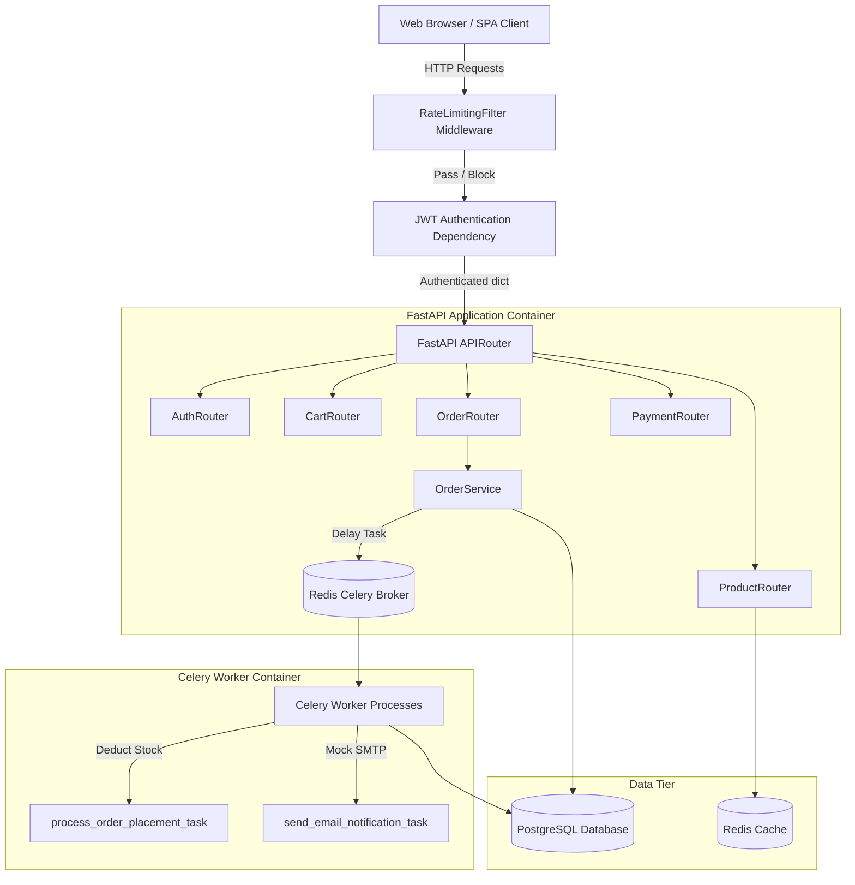
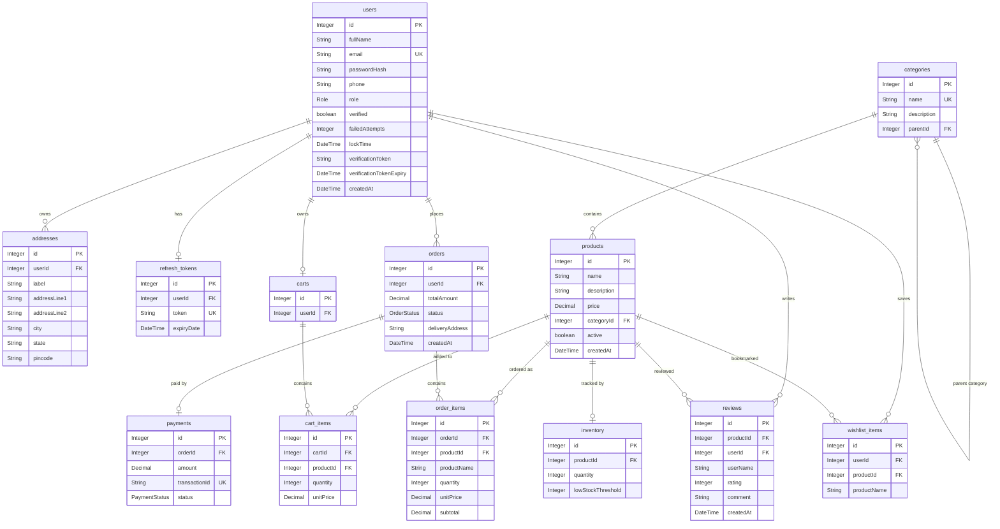

# CommerceFlow — Asynchronous FastAPI Modular Monolith E-Commerce

CommerceFlow is a production-ready, interview-defensible modular monolith e-commerce backend built with **Python 3.13** and **FastAPI**. By using a clean package-per-feature architecture, the codebase mirrors the logical division of microservices while avoiding their operational complexity and network latency.

---

## 🌟 Core Features & Python Optimizations

### 1. Asynchronous Everywhere (Async/Await)
FastAPI runs on an ASGI server (Uvicorn), enabling high-concurrency request processing. The entire application database layer is built using **SQLAlchemy 2.0 (Async)** and **asyncpg** (async PostgreSQL driver), eliminating blocking database wait-states. Caching is handled asynchronously via Redis (`redis-py` async client).

### 2. Real-World Task Queue (Celery + Redis)
Instead of inside-the-process event publishing, CommerceFlow implements a distributed task queue utilizing **Celery** with **Redis** as a message broker.
- Core checkout, stock allocation, payment initialization, and mock email alerts are offloaded to Celery background workers.
- If a high-volume spike occurs during checkout, the FastAPI web app returns a response to the customer immediately, while the worker asynchronously handles the stock updates and notifications.

### 3. AI Product Recommendation Engine
Personalized shopping suggestions are generated dynamically by a built-in recommendation engine (`GET /api/products/recommendations`) based on:
- **Category Similarity**: Products matching the categories of user's previous orders or wishlist saves.
- **Purchase History Co-occurrence**: Finds common items bought together by other shoppers (e.g., if Mouse + Keyboard is purchased, suggest Laptop Stand, Desk Mat, USB Hub).
- **Collaborative Filtering**: Recommends products purchased by users with similar order profiles.

### 4. Pluggable AI Review Summarizer
Instead of parsing thousands of comments manually, users get a structured highlights summary (`GET /api/reviews/product/{id}/ai-summary`) compiled by our AI engine:
- Built with a pluggable `AIService` running a local NLP rule-based parser by default (100% offline & zero-config).
- Includes ready-to-use commented configurations for swapping to **Google Gemini API** or local **Hugging Face Transformers** (BART models) in production.

### 5. Advanced Security & Threat Mitigation
- **JWT + Refresh Token Rotation (RTR)**: Access tokens expire in 15 minutes. Refreshing a token generates a new refresh token and deletes the old one to prevent token-reuse/replay attacks.
- **Brute-Force Account Locking**: Users are locked out for 30 minutes after 5 consecutive failed login attempts, guarding against dictionary attacks.
- **Client IP Rate Limiting**: An early-stage custom token-bucket middleware restricts clients to 100 requests per minute per IP address.
- **Checkout Email Verification**: Users must verify their email via aUUID token link to complete checkouts.

---

## 🛠️ Tech Stack & Versioning

| Component | Technology | Version / Coordinate |
|---|---|---|
| **Core Runtime** | Python | 3.13 / 3.12 |
| **Framework** | FastAPI | 0.115.6 |
| **ASGI Server** | Uvicorn | 0.34.0 |
| **Database ORM** | SQLAlchemy | 2.0.36 (Async) |
| **DB Driver** | asyncpg | 0.30.0 |
| **Validation / DTOs** | Pydantic | 2.10.4 |
| **Settings** | Pydantic Settings | 2.7.0 |
| **Task Queue** | Celery | 5.4.0 |
| **Cache & Broker** | Redis | 4.6.0 |
| **Testing** | Pytest + pytest-asyncio | 8.x / 0.25.x |
| **Security / Hash** | PyJWT + Bcrypt | 2.10.1 / 4.2.1 |

---

## 📐 System Architecture Diagram



## 🗄️ Entity Relationship (ER) Diagram



---

## 📁 Modular Monolith Directory Structure

```
app/
├── auth/               # Signup, login, refresh token, password hashing
├── users/              # User profiles, Address CRUD
├── products/           # Categories, products, specifications search, AI recommendations
├── inventory/          # Stock refills, thresholds, admin adjustments
├── cart/               # DB cart line items, pricing snapshots
├── orders/             # Checkout logic, Celery background tasks & workers
├── payments/           # Simulated payment gateways & confirmations
├── reviews/            # 1-5 star ratings, pluggable AI Review summary engine
├── wishlist/           # User saved bookmarks
├── admin/              # Dashboard aggregations (revenue, user count, pending orders)
├── common/             # Settings, database configs, generic ApiResponse envelopes, data seeder
└── security/           # JWT verifications, Rate Limiting token-bucket middleware
```

---

## 🚀 Getting Started & Local Runs

### 📝 Prerequisites
- **Python 3.12+**
- **pip** and **virtualenv** (optional, recommended)
- **Docker** and **Docker Compose** (for full containerization runs)

### 💻 Local Development Run (Using SQLite and no Celery worker required)
FastAPI can run fully with a local SQLite file in dev mode. 
```bash
# 1. Install dependencies
pip install -r requirements.txt

# 2. Run the FastAPI ASGI server
uvicorn app.main:app --reload --port 8080
```
Open **`http://localhost:8080/`** in your browser. Spring Boot static frontend SPA files have been fully ported and are hosted directly by Uvicorn.
- **Swagger Documentation**: [http://localhost:8080/docs](http://localhost:8080/docs)

### 🐳 Full Production Run (Docker Compose - PostgreSQL + Redis + Celery Worker)
To spin up the production Postgres database, Redis cache broker, Celery worker process, and the FastAPI application:
```bash
docker-compose up --build
```
This launches:
- **FastAPI Web Server** on port `8080`
- **Celery Worker** executing async background queues
- **PostgreSQL Database** on port `5432`
- **Redis Cache & Broker** on port `6379`

---

## 🔑 Demo Seeding & Default Credentials
On database creation, the application seeder automatically populates sample categories, products, inventory records, and demo accounts:

- **Admin Account**: `admin@commerceflow.com` / `admin123`
- **Customer Account**: `customer@commerceflow.com` / `customer123`

---

## 🧪 Running Automated Tests
CommerceFlow has fully covered service tests using **pytest** and **pytest-asyncio** mocking database sessions and celery queues:
```bash
python -m pytest
```
- `tests/test_auth.py`: Tests email duplicates, token rotation, and account locking lockout time validations.
- `tests/test_orders.py`: Tests empty cart checkouts, unverified email blockages, and Celery task delays.
